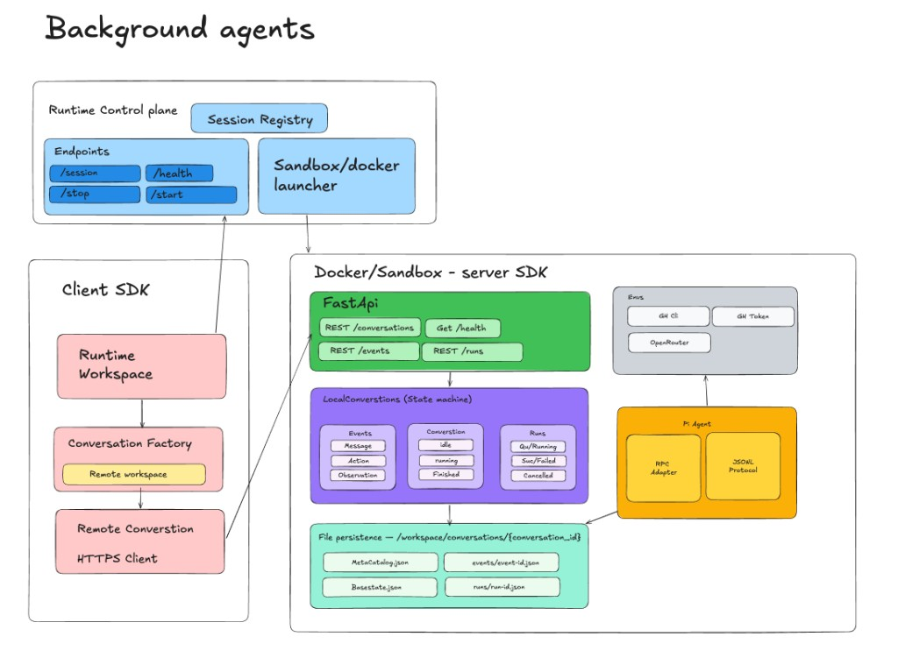

# gg-agent-server

The shortest mental model is: **control plane manages sandboxes; client SDK provides the interface; server SDK manages conversation state; Pi Agent executes the work.**



## Develop

Python 3.12. Packages live under `packages/gg-sdk` and `packages/gg-server`.

```bash
uv sync --no-editable
uv run pytest
uv run ruff check .
uv run python -m gg.server --host 127.0.0.1 --port 8000
```

Use `uv sync --no-editable`. Default editable installs break `import gg` on Python 3.12.

## Demo

Start the control plane locally with dispatch enabled. A submitted task is admitted and the scheduler provisions a Modal sandbox for it.

```bash
set -a && source .env && set +a
GG_RUNTIME_API_KEY=local-demo \
GG_TASK_DB_PATH=/tmp/gg-tasks.sqlite \
GG_TASK_DISPATCH_ENABLED=true \
uv run --no-editable python -m gg.runtime
```

In another shell, submit a general task:

```bash
GG_RUNTIME_API_KEY=local-demo \
uv run --no-editable gg-task submit \
  --prompt "Say hello" \
  --idempotency-key hello-1
```

## Docs

- [Architecture](docs/architecture.md)
- [Plan](docs/tasks/overview.md)
- [Task tracker](docs/tasks/README.md)
