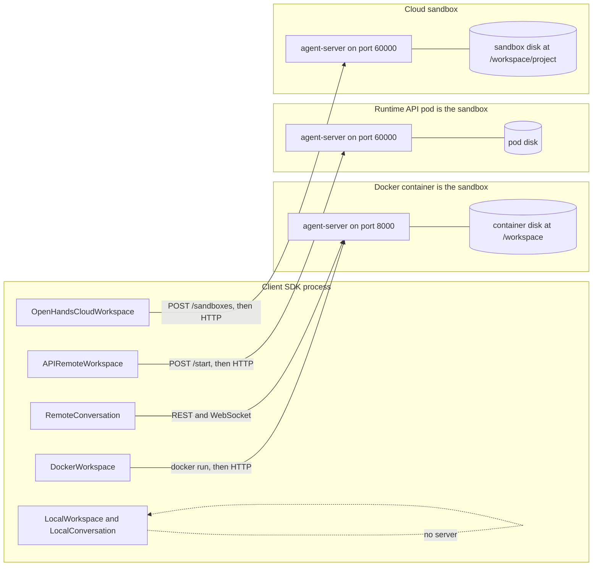
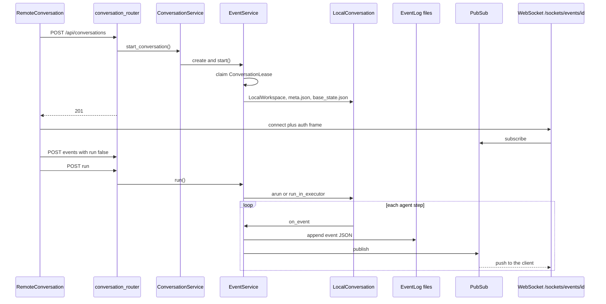
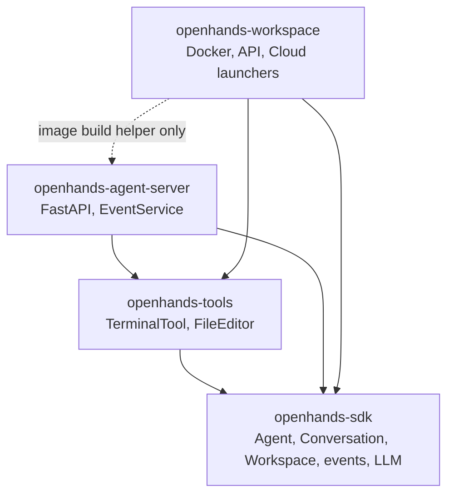

# About the OpenHands agent-server

This page explains how `openhands-agent-server` runs software agents on a laptop, in Docker, and behind a cloud runtime. It is a reading companion for a later, smaller clone in this repo. It is not a tutorial and not an API catalog.

The facts come from a read of the local OpenHands tree at `../software-agent-sdk` on 21 Aug 2026. If that tree moves, the paths below still name the same files inside the `software-agent-sdk` checkout.

Standalone mermaid sources live next to this page:

- [Deployment topology](diagrams/deployment.mmd)
- [Conversation loop](diagrams/conversation-loop.mmd)
- [Package graph](diagrams/packages.mmd)

Open this file in the editor preview so the diagrams render.

## Why the server exists

The SDK can run an agent in your Python process. That is `LocalConversation` plus `LocalWorkspace`. You use that path for a script on your own disk.

You run the agent-server when another process needs to start conversations, stream events, and touch files without embedding the SDK. A GUI backend, a Docker sandbox, and a hosted runtime all take that path. The server is a long-lived FastAPI process. The client talks to it with HTTP and WebSocket.

## The sandbox inversion

The server does not launch sandboxes. The server is the process that gets launched inside one.

`DockerWorkspace`, `APIRemoteWorkspace`, and `OpenHandsCloudWorkspace` live in `openhands-workspace`. Each one provisions a box, then talks HTTP to the agent-server that is already PID 1 in that box. Running `python -m openhands.agent_server` on your laptop is the same design with the box removed.

Inside the process, `ConversationService` owns a catalog of conversations. Each live conversation is an `EventService` that wraps a `LocalConversation` from `openhands-sdk`. The agent loop shares a thread pool. Events go to JSON files and to in-process pub/sub. There is no database and no message broker. One process is one sandbox. Many conversations can live in that process.

That inversion is the whole architecture. Miss it and Docker, Cloud, and "local filesystem" look like four backends. They are four ways to start the same process.

## Key types

**`Config`.** Frozen Pydantic model in `openhands-agent-server/openhands/agent_server/config.py`. A JSON file loads first. `OH_*` env vars override it through a custom `EnvParser`. Env wins.

**`ConversationService`.** Process-wide manager in `conversation_service.py`. It builds a catalog from `conversations_dir/*/meta.json`. It owns a shared `ThreadPoolExecutor` capped at `max_concurrent_runs`. The default cap is 10.

**`EventService`.** One per live conversation, in `event_service.py`. It owns the `LocalConversation`, the `EventLog`, and `PubSub`. It drives run, pause, and interrupt.

**`Conversation` factory.** `Conversation.__new__` in the SDK. A `RemoteWorkspace` yields `RemoteConversation`, which is an HTTP and WebSocket client. A `LocalWorkspace` yields `LocalConversation`, which runs the agent in process. The server always builds `LocalConversation`.

**`Workspace` factory.** No `host` yields `LocalWorkspace`. A `host` yields `RemoteWorkspace`. Docker, API, and Cloud subclasses add provisioning on the client side.

**`EventLog`.** One JSON file per event under `events/`.

**`PubSub`.** In-process fan-out. The cap is 50 subscribers. It is not a broker.

**`ConversationLease`.** File `owner_lease.json` with a 45 second TTL, renewed every 15 seconds. It stops two server processes from owning the same conversation on shared disk.

## How deployments differ

The entry is `python -m openhands.agent_server` or the `agent-server` console script. `__main__.main()` starts uvicorn on `openhands.agent_server.api:api`. With no session keys the process binds `127.0.0.1`. With keys it binds `0.0.0.0`.

Launchers run in the client SDK process, not in the server.

`DockerWorkspace.model_post_init` runs `docker run ghcr.io/openhands/agent-server:latest-python --host 0.0.0.0 --port 8000`, maps a host port, and polls `GET /health`.

`APIRemoteWorkspace` posts to a Runtime API `/start` endpoint and waits for a sysbox-runc pod. Kubernetes sits behind that API. The OpenHands SDK tree has no `KubernetesWorkspace` class.

`OpenHandsCloudWorkspace` posts to Cloud `/api/v1/sandboxes` and uses the exposed `AGENT_SERVER` URL. API and Cloud listen on port 60000.



The agent, its tools, and the files live in the same box as the server. `TerminalTool` and `FileEditor` call into `working_dir` in process. They never hit `/api/bash`. Isolation is the container. The image gives the `openhands` user passwordless sudo. Full images also install Docker-in-Docker so tools can run Docker.

I think that last point is the part that surprises people. The server is not a hypervisor. It is a web API in front of a local conversation loop. The box around it is someone else's job.

## HTTP and auth

Public paths are `/alive`, `/health`, `/ready`, `/server_info`, and `/docs`. Routes under `/api` require header `X-Session-API-Key` when `session_api_keys` is set. An empty key list means a fully open server. Workspace static files also accept cookie `oh_workspace_session_key`. The OpenAI-compatible routes at `/v1` accept a Bearer token or the session key. WebSockets authenticate with a first JSON frame. That frame looks like `{"type":"auth","session_api_key":"..."}`.

`/health` answers as soon as uvicorn serves requests. `DockerWorkspace` waits on that. `/ready` answers after lifespan sidecars start. With `deferred_init=True`, `/ready` is true while the server is still dormant. Routes under `/api` return 503 until `POST /api/init`. Treat `/ready` as boot-complete. Do not treat it as proof that the conversations API works.

The main `/api` routers cover conversations, events, bash, git, file, vscode, desktop, skills, sub-agents, plugins, hooks, llm, mcp, settings, workspaces, profiles, agent-profiles, auth, tools, and credential-bindings. Sockets live at `/sockets/events/{conversation_id}` and `/sockets/bash-events`.

## How a conversation runs

A client posts `StartConversationRequest` to `POST /api/conversations`. The agent spec is one of `agent`, `agent_settings`, or `agent_profile_id`. The service pops the agent before it writes `meta.json`. The agent lives in `base_state.json`. Posting the same `conversation_id` again reattaches and returns 200. There is no `/resume` route. Reattach is resume.

`EventService.start()` claims a `ConversationLease` unless the TTL is 0. Then it builds a `LocalConversation` over a `LocalWorkspace`. If the client used a `RemoteWorkspace`, the SDK converts that into a `LocalWorkspace` payload first. From the server's point of view the workspace is always local. A conversation found in `RUNNING` state on start is crash recovery. The service flips it to `ERROR` and appends a synthetic `AgentErrorEvent`.

Running is explicit on the REST path. `RemoteConversation.send_message` posts the message with `run=False`, then posts `/run`. A message sent over the WebSocket always implies `run=True`. `EventService.run()` creates an asyncio task. If the agent overrides `astep`, the server awaits `conversation.arun()` on its event loop. Otherwise it calls `run_in_executor` on the shared pool. Pause is cooperative and lands between steps. Interrupt cancels the run task.

Each event goes to `EventLog` and to `PubSub`. `EventLog` writes `events/event-{idx}-{id}.json`. `PubSub` fans out to WebSocket subscribers and webhook posters. `StreamingDeltaEvent` is the exception. It streams live tokens and is never persisted.



Idle conversations drop the `EventService` and keep the files. The next request rehydrates from disk.

Sub-agents are two different things. `POST /api/sub-agents` is a catalog of definitions. At runtime they are `agent_definitions` registered into the SDK. Nested conversations link through `parent_conversation_id` in the same workspace. Deleting a parent orphans children. Deleting a conversation never deletes workspace files.

## Two meanings of workspace

On the client, `Workspace` is the transport. `LocalWorkspace` talks to the host disk. `RemoteWorkspace` talks HTTP to an agent-server. On the server, the conversation workspace is always a `LocalWorkspace` rooted at `working_dir` on that process's disk.

Defaults differ by launcher. Docker and API use `/workspace`. Cloud uses `/workspace/project`. The server's own `Config.workspace_path` defaults to the relative path `workspace/project`.

Two differences cause bugs. `LocalWorkspace.execute_command` with no cwd uses `working_dir`. The remote path does not, so a Docker command without a cwd runs in `/`. `clone_repos` runs `git clone` in the client process, not through the server.

`DockerWorkspace` mounts nothing by default. Pass `volumes=["/host/dir:/workspace"]` or the agent sees an empty `/workspace`. The old `mount_dir` field now raises `ValueError`.

`/api/bash` and the file router are a parallel channel for a human or an orchestrator. Their events are not visible to the agent. The workspace static file router jails paths to `working_dir`. `/api/file/upload`, `/api/file/download`, and the agent's `FileEditor` do not. The container is the security boundary. A no-auth server pointed at a host filesystem is a remote shell.

`OpenHandsCloudWorkspace` has a second mode. With `local_agent_server_mode=True` the SDK is already inside the sandbox, talks to `localhost:60000`, and still calls the Cloud API for LLM config and secrets.

## What lands on disk

All persistence is files. `sqlalchemy`, `alembic`, and `aiosqlite` appear in `pyproject.toml` and nothing imports them.

A conversation directory looks like this:

```text
{conversations_path}/{conversation_id.hex}/
  meta.json
  base_state.json
  events/event-{idx:05d}-{event_id}.json
  owner_lease.json
```

The OpenHands README still shows `metadata.json` and `events.jsonl`. The code does not write those names.

Settings, secrets, and profiles live under `~/.openhands` unless `OH_PERSISTENCE_DIR` overrides that. Secrets are Fernet-encrypted with a key derived from sha256 of `OH_SECRET_KEY`. No key means secrets are not persisted across restarts. A wrong key decrypts to `None`, which looks identical to redaction.

## Four packages

The SDK repo is a uv workspace of four packages that share one version under the `openhands.*` namespace.



`openhands-sdk` imports none of the other three. That is why a `LocalConversation` with a `LocalWorkspace` needs no server, and why the server can embed one directly.

`openhands-tools` holds `TerminalTool`, `FileEditorTool`, and the other tool implementations. `openhands-agent-server` is the FastAPI process. `openhands-workspace` is the client-side launchers. `DockerDevWorkspace` lazily imports `openhands.agent_server.docker.build` to bake images. That is the only reverse edge.

Fleet scheduling is not in this tree. One process equals one sandbox. Warm pools use `deferred_init` plus `/api/init`. Leases cover shared storage. The orchestrator lives elsewhere.

## Sharp edges

The OpenHands README is stale in several places. Default host, reload, auth header, webhook field names, and the on-disk layout all drifted from the code.

`/ready` returning 200 does not mean `/api/conversations` works. In deferred-init mode those routes return 503 until `/api/init`.

`DockerWorkspace` forwards `SESSION_API_KEY` and `OH_SESSION_API_KEYS_0` from the host env into the container, so the server enforces auth. Then line 278 of `openhands-workspace/openhands/workspace/docker/workspace.py` forces the client's `api_key` to `None`. If those env vars are set on your host, the launcher gets 401s. `ApptainerWorkspace` copies the key. That looks like a bug.

Remote `execute_command` without a cwd runs in `/`. Local defaults to `working_dir`. Same method name, different behavior.

Event webhook URLs use the hex form of the UUID. REST uses the dashed form.

Empty `session_api_keys` opens every endpoint. Localhost bind is the only protection in that mode.

`openhands-agent-server` imports `openhands.tools` without declaring that dependency in its `pyproject.toml`. The uv workspace and the Docker image hide the gap. A pip-only install of the server package would miss tools.

