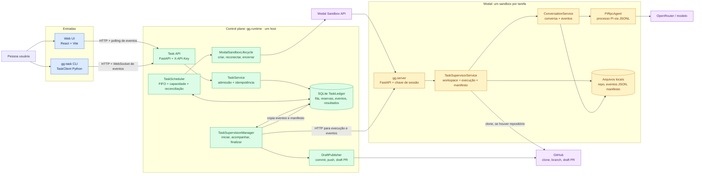

# Arquitetura do gg-agent-server

> **Em uma frase:** um control plane recebe tarefas e guarda seu estado; um scheduler cria um sandbox Modal por tarefa; dentro dele, o servidor conversa com o agente Pi; ao final, o control plane preserva o resultado e, quando cabível, publica um draft pull request.

## Visão geral



As setas mostram **chamadas ou dados**, não dependências de importação. A fronteira mais importante é entre o control plane e o sandbox: `gg.runtime` fala com `gg.server` por HTTP; ele não executa o agente no próprio host. O diagrama mostra o caminho de produção com dispatch habilitado.

## Caminho de uma tarefa

```mermaid
sequenceDiagram
    autonumber
    actor Pessoa
    participant Cliente as Web UI / CLI
    participant API as gg.runtime API
    participant Supervisor as gg.runtime Supervisor
    participant DB as SQLite TaskLedger
    participant Scheduler as Scheduler + Modal
    participant Sandbox as gg.server no sandbox
    participant Pi as Pi + modelo
    participant GitHub

    Pessoa->>Cliente: prompt, chave de idempotência, repo/base_ref opcionais
    Cliente->>API: POST /tasks (X-API-Key)
    API->>DB: grava tarefa queued e sequência FIFO
    API-->>Cliente: id e estado da tarefa
    Scheduler->>DB: reconcilia reservas e reserva vaga
    Scheduler->>Sandbox: cria sandbox Modal e inicia execução por HTTP
    opt tarefa de repositório
        Sandbox->>GitHub: clona repo e abre branch da tarefa
    end
    Sandbox->>Pi: executa prompt no workspace via RPC JSONL
    Pi-->>Sandbox: mensagens, ações e observações
    Sandbox->>Sandbox: grava eventos JSON e manifesto
    Supervisor->>Sandbox: acompanha execução; copia eventos e manifesto
    Supervisor->>DB: arquiva evidências e resultado
    opt repo com alterações e agente bem-sucedido
        Supervisor->>GitHub: commit, push e draft PR
        GitHub-->>Supervisor: URL do PR
    end
    Scheduler->>Sandbox: encerra; libera vaga após confirmar ausência
    Cliente->>API: consulta estado, eventos e resultado
    API-->>Cliente: progresso e resultado duráveis
```

O fluxo admite tarefas **gerais**, com workspace vazio, e tarefas de **repositório**, com `owner/name` e `base_ref`. Ambas usam a mesma fila e o mesmo ciclo de vida. A publicação é condicional: tarefas gerais e alterações vazias não geram PR. O código atual não roda comandos obrigatórios de bootstrap ou checks; o manifesto registra `check_outcome = not_run` quando nenhum check foi executado.

## Building blocks e responsabilidades

No repositório, `backend/` contém `gg.runtime`; `sandboxes/` contém
`gg.server` e a execução Pi; `frontend/` contém o cliente React. O
`packages/gg-sdk/` contém contratos e o cliente Python.


| Bloco | Módulos principais | Responsabilidade |
|---|---|---|
| **Web UI** | [`frontend/src/App.tsx`](../frontend/src/App.tsx), [`frontend/src/api.ts`](../frontend/src/api.ts) | Cria e lista tarefas; consulta eventos, resultado e PR. Usa polling porque WebSocket no navegador não envia o header de autenticação exigido. O composer de follow-up ainda está desabilitado. |
| **SDK e CLI** | [`gg/sdk/task_client.py`](../packages/gg-sdk/gg/sdk/task_client.py), [`gg/sdk/cli/`](../packages/gg-sdk/gg/sdk/cli/) | Cliente tipado da Task API: submit, leitura, eventos, mensagem, cancelamento e retry. A CLI é outra entrada para o mesmo contrato. |
| **Modelos compartilhados** | [`gg/sdk/tasks.py`](../packages/gg-sdk/gg/sdk/tasks.py), [`gg/sdk/task_execution.py`](../packages/gg-sdk/gg/sdk/task_execution.py), [`gg/sdk/domain.py`](../packages/gg-sdk/gg/sdk/domain.py) | Contratos Pydantic imutáveis para tarefas, execução, conversa e eventos. `gg.sdk` não importa `gg.server`. |
| **Task API e serviço** | [`gg/runtime/app.py`](../backend/gg/runtime/app.py), [`task_routes.py`](../backend/gg/runtime/task_routes.py), [`task_service.py`](../backend/gg/runtime/task_service.py) | Autentica, valida, admite com idempotência e expõe estado, resultado, eventos, mensagem, cancelamento e retry. |
| **Ledger durável** | [`gg/runtime/ledger.py`](../backend/gg/runtime/ledger.py), [`storage.py`](../backend/gg/runtime/storage.py) | SQLite mantém fila FIFO, reservas, identidade do sandbox, recibos, cópias de eventos, manifesto, publicação e limites de retenção. |
| **Scheduler e infraestrutura** | [`gg/runtime/scheduler.py`](../backend/gg/runtime/scheduler.py), [`modal_sandbox.py`](../backend/gg/runtime/modal_sandbox.py) | Reserva capacidade, cria/reativa/encerra sandboxes e reconcilia estados ambíguos após reinício. O lock limita o dispatch a um processo no host. |
| **Supervisão e publicação** | [`gg/runtime/task_supervision/manager.py`](../backend/gg/runtime/task_supervision/manager.py), [`publication.py`](../backend/gg/runtime/publication.py) | Inicia e acompanha a execução remota, copia evidências, conclui a tarefa e publica draft PR com journal e reconciliação de efeitos remotos. |
| **Servidor no sandbox** | [`gg/server/app.py`](../sandboxes/gg/server/app.py), [`task_supervisor/service.py`](../sandboxes/gg/server/task_supervisor/service.py), [`conversation_service.py`](../sandboxes/gg/server/conversation_service.py) | Recebe comandos do control plane, prepara repo/workspace, executa a conversa e escreve eventos e manifesto locais. |
| **Agente** | [`gg/server/agent/pi_agent.py`](../sandboxes/gg/server/agent/pi_agent.py), [`local_conversation.py`](../sandboxes/gg/server/agent/local_conversation.py), [`event_log.py`](../sandboxes/gg/server/agent/event_log.py) | Executa o Pi como subprocesso RPC, comunica-se com o modelo, persiste eventos e recebe steering/cancelamento durante a execução. |

## Estado, segurança e recuperação

- **Duas camadas de persistência:** SQLite no host é a fonte durável da fila e do resultado; arquivos JSON no sandbox mantêm a conversa e o manifesto durante a execução. O runtime copia as evidências antes de limpar o sandbox.
- **Duas credenciais:** o cliente usa `X-API-Key` na Task API; o control plane usa uma chave de sessão independente nas chamadas ao servidor do sandbox. Tokens de conexão Modal e chaves de sessão não são devolvidos nos registros públicos da tarefa.
- **Falhas e reinícios:** o scheduler reconcilia reservas e identidades Modal antes de admitir mais trabalho. Uma criação ou remoção incerta ainda ocupa capacidade. O control plane pode se reconectar a um sandbox sobrevivente; se o processo supervisor dentro do sandbox perder a execução, a tarefa falha em vez de repetir o prompt sem controle.
- **Escala atual:** um host com SQLite e um processo de dispatch; limite configurável de até dez reservas simultâneas. Cada tarefa tem seu próprio sandbox Modal. Não há broker nem banco distribuído.
- **Operação:** [`docs/single-host-production.md`](single-host-production.md) descreve backup, retenção, readiness e smoke tests; [`docs/modal-sandboxes.md`](modal-sandboxes.md) descreve imagem, quotas e ciclo de vida.

## Como apresentar em 60 segundos

“Construímos uma plataforma de agentes em background. A interface web e a CLI chamam uma API única. O control plane grava cada tarefa em SQLite, garante idempotência e agenda em ordem FIFO respeitando um limite de sandboxes. Cada tarefa roda isolada no Modal; lá, um servidor FastAPI prepara o workspace, aciona o Pi por RPC e registra os eventos. O control plane acompanha a execução, copia as evidências para armazenamento durável e, quando uma tarefa de repositório produz alterações, publica um draft PR no GitHub. O ponto central da arquitetura é manter agendamento e recuperação separados da execução do agente, com contratos HTTP e modelos compartilhados no SDK.”
