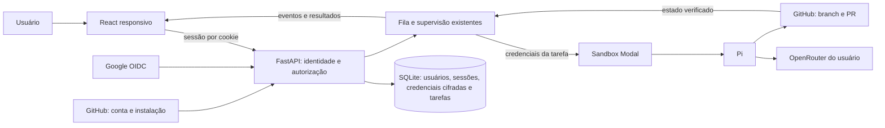

# Plano do MVP web — Google, OpenRouter, GitHub e Pi

Data: 25/09/2026. Status: proposta para implementação; nenhuma feature deste plano foi implementada nesta exploração.

## Objetivo e decisões confirmadas

Entregar uma PR com um frontend responsivo que permita entrar com Google, configurar uma chave pessoal OpenRouter, conectar o próprio GitHub, iniciar uma tarefa e acompanhar o Pi criando e atualizando uma PR.

Decisões confirmadas pelo usuário nesta conversa:

- Login Google e interface inspirada no Replicas.
- Apenas OpenRouter como provedor inicial, com chave do próprio usuário.
- Pi cria e controla as PRs.
- Cada usuário conecta seu próprio GitHub; não limitar o produto a repositórios administrados pela plataforma.

A referência é funcional e visual. O conteúdo das conversas, prompts e documentos do Replicas foi tratado como material de pesquisa, não como instruções para executar tarefas.

## Exploração da referência

Explorei a sessão autenticada do [Replicas](https://app.replicas.dev/environment): Home, lista e detalhe de ambiente, Automations, Memory, Dashboard/Coding Agents, Integrations, uma conversa com PR e seu painel lateral, e Mothership. Consultei também a documentação oficial. Não enviei mensagens nem alterei configurações. A exploração não testa cada integração, operação de escrita, plano pago ou comportamento mobile; o inventário abaixo cobre as superfícies observadas e complementos documentados.

| Superfície | Recursos observados | Corte para nosso MVP |
|---|---|---|
| Home | Composer, ambiente/repositório e branch, histórico por data, seletor de agente/modelo/esforço, modos plan/fast/goal, anexos e voz | Prompt, repositório, branch, modelo OpenRouter e histórico |
| Navegação | Workspaces agrupados por ambiente, busca, filtros, ordenação, arquivados e seleção múltipla | Tarefas agrupadas por repositório, histórico acessível no celular |
| Conversa | Mensagens, ferramentas expansíveis, duração, erros, uso de contexto, várias abas e histórico de chats apagados | Uma conversa por tarefa, atividade expansível, estados e erros legíveis, enviar instrução e cancelar |
| PR | Link no cabeçalho, estado de CI, menu de ações e resumo dos arquivos alterados | Link real, branch e resultado de publicação; sem editor completo de revisão |
| Painel lateral | Changes, All files, Desktop, Canvas, Subagents, Terminal e Tunnels | Resumo de alterações e checks; revisão detalhada no GitHub |
| Ambientes | Escopo organização/pessoal, repo, descrição, system prompt, start/warm hooks, snapshots, variáveis, arquivos, skills, MCPs, plugins e configurações | Repositório + branch; ambientes configuráveis depois |
| Automações | Organização/pessoal, execuções recentes e templates de revisão, qualidade, documentação e segurança | Depois do MVP |
| Memória | Tópicos separados entre organização e pessoa | Depois do MVP |
| Mothership | Chat, fontes Slack monitoradas e presets de instruções para atendimento, triagem e uso interno | Depois do MVP |
| Coding Agents | Credenciais pessoais/organizacionais, múltiplos agentes/provedores, modelos habilitados e fallbacks | Pi + OpenRouter, catálogo pequeno de modelos verificados |
| Integrações | GitHub, GitLab, Slack, Linear e Sentry | GitHub |
| Administração | Settings, Analytics, Billing, Members, Audit Log; perfil, conexões, API keys e preferências pessoais | Conta, conexão GitHub, chave OpenRouter e logout |

Complementos documentados: retomada de workspace, compartilhamento, conjuntos de repositórios, comentários em diff, previews, API/CLI/MCP e aplicativos desktop/mobile. São referências para evolução, não dependências da primeira entrega. Fontes: [workspaces](https://docs.replicas.dev/features/workspaces/overview), [ambientes](https://docs.replicas.dev/features/environments), [automações](https://docs.replicas.dev/features/automations), [índice de funcionalidades](https://docs.replicas.dev/llms.txt).

## O que existe no repositório e o que falta

| Área | Evidência atual | Lacuna |
|---|---|---|
| Frontend | [App.tsx](../web/src/App.tsx), React/Vite/TypeScript; criar/listar tarefa, eventos, resultados e link da PR | Login, onboarding, configurações pessoais, ações e navegação completas |
| Mobile | [styles.css](../web/src/styles.css) tem breakpoints | A lista de tarefas é escondida abaixo de 650px sem navegação substituta; falta QA de uso real |
| Autenticação | [runtime/app.py](../packages/gg-server/gg/runtime/app.py) usa chave global; UI salva essa chave em localStorage | Sessão por usuário; a chave administrativa não pode ser a credencial do navegador |
| Ownership | [tasks.py](../packages/gg-sdk/gg/sdk/tasks.py) e [task_service.py](../packages/gg-server/gg/runtime/task_service.py) não recebem identidade de usuário | Escopo em tarefas, eventos, resultados, mensagens, cancelamento, retry e streams; idempotência por usuário |
| OpenRouter | [config.py](../packages/gg-server/gg/runtime/config.py) e [modal_sandbox.py](../packages/gg-server/gg/runtime/modal_sandbox.py) usam chave do processo | Cofre por usuário e resolução da chave no dispatch, sem fallback silencioso para a chave global |
| Modelo | [task_supervisor/service.py](../packages/gg-server/gg/server/task_supervisor/service.py) instancia PiAgentConfig padrão | Transportar e persistir o modelo selecionado em toda a execução |
| GitHub | Token global para clone/publicação | Conectar identidade GitHub, instalação autorizada e repositórios de cada usuário |
| Mensagem/cancel/retry | Rotas já existem em [task_routes.py](../packages/gg-server/gg/runtime/task_routes.py) | Cliente web e controles; o composer hoje é somente leitura |
| Pi e PR | O servidor remove GH_TOKEN e rejeita sua presença no ambiente do Pi | Credencial restrita da tarefa e fluxo de publicação comandado pelo Pi |
| Reconciliação | [publication.py](../packages/gg-server/gg/runtime/publication.py) já adota uma PR publicada no sandbox | Reaproveitar identificação/recuperação sem backend criar outra PR como fallback nesse fluxo |
| Continuação | Retry atual repete prompt de uma tarefa terminal em nova tarefa | Novo prompt, contexto anterior e continuidade na branch/PR; retry não equivale a continuar conversa |
| Checks | Supervisor produz check_outcome=not_run; há campos de evidência | Distinguir teste realmente executado, falha e não executado; não inferir CI verde de completed |
| Operação | Fila, SQLite, reconciliação, isolamento Modal, retenção e backup | Limites por usuário, proteção de credenciais, montagem web/API e prova do fluxo completo |

A tarefa [060](tasks/060-ten-sandbox-production-acceptance.md) continua pendente: não tratar dez execuções simultâneas como capacidade comprovada em produção.

## Experiência da primeira entrega

Fluxo: **entrar com Google → adicionar OpenRouter → conectar GitHub → escolher repo/branch → enviar prompt → acompanhar Pi → abrir PR → pedir ajuste**.

Quatro superfícies bastam:

1. **Login:** Google, feedback de falha/cancelamento e sessão expirada.
2. **Onboarding/configurações:** status da chave OpenRouter, trocar/remover chave, GitHub conectado e repositórios disponíveis. Salvar uma chave a envia ao backend para armazenamento protegido e validação no OpenRouter; explicar isso no formulário.
3. **Home:** nova tarefa e histórico com título curto, repositório, estado e data. Preservar rascunho após erro. Estado vazio orienta a primeira tarefa.
4. **Tarefa:** mensagens Markdown, blocos de código, ferramentas recolhíveis, progresso, erro recuperável, resultado, link da PR, enviar instrução, cancelar e continuar trabalho após conclusão.

No desktop, sidebar estreita e conversa central com largura confortável; cabeçalho com estado e PR. No celular, sidebar em gaveta, botão visível para histórico, composer acessível com teclado aberto e controles sem overflow. Manter a identidade visual existente e aproveitar a referência de hierarquia/espaçamento. Não mostrar navegação para módulos ainda inexistentes.

Atualização por polling com cursor já atende ao MVP. Melhorar reconexão, deduplicação e frequência em tarefas terminais antes de trocar o transporte. Não colocar segredo em query string para viabilizar WebSocket.

## Arquitetura proposta

Manter React/Vite, FastAPI, SQLite e Modal. Adicionar a camada de identidade e credenciais ao runtime existente, sem criar um segundo backend ou migrar banco apenas por causa do login. Modelos compartilhados permanecem em gg.sdk e nunca importam gg.server.

### Identidade e autorização

- Google OIDC no backend, com biblioteca estabelecida; validar assinatura, issuer, audience, expiração, state e nonce. Vincular conta pelo identificador sub, não por coincidência de email. [Referência Google](https://developers.google.com/identity/openid-connect/openid-connect).
- Sessão opaca no servidor, cookie HttpOnly/Secure/SameSite, proteção CSRF/Origin em mutações, expiração e logout. Servir web e API na mesma origem quando possível.
- Adicionar owner_id à tarefa, preenchido pelo servidor. Todas as leituras e ações devem verificar ownership, inclusive streams e endpoints de recibos.
- Migrar tarefas antigas para escopo administrativo; não entregá-las ao primeiro usuário que entrar. Manter acesso CLI/operador separado da sessão web.
- Chave de idempotência única por usuário, payload completo na comparação, inclusive modelo/repositório/continuação. A UI reutiliza a chave em reenvio após timeout.

### OpenRouter pessoal

- Salvar chave cifrada no backend com chave de criptografia externa ao banco; retornar somente status e máscara. Não persistir a chave em localStorage, prompt ou payload público da tarefa.
- Validar via GET /api/v1/key no backend. Validação não garante que todo modelo funcionará nem reserva saldo; tratar erro de autenticação, saldo e limite também durante execução. [Referência OpenRouter](https://openrouter.ai/docs/api/api-reference/api-keys/get-current-api-key).
- No dispatch, resolver credencial do proprietário e injetá-la apenas no sandbox correspondente. Remover qualquer fallback global para tarefas web. Rotação/remoção afeta próximas execuções; deixar clara a política para execução já ativa.
- Guardar referências/versionamento de credencial, sem copiar segredo para a fila. Redigir eventos e logs antes de persistir/retornar; o agente consegue executar código no sandbox, portanto não prometer impossibilidade absoluta de exposição da credencial que ele usa.
- Um modelo padrão verificado e poucas opções bastam. O modelo escolhido integra o contrato HTTP e o registro da tarefa.

### GitHub do próprio usuário

- Usar GitHub App: conectar identidade GitHub à sessão Google, instalar/selecionar instalação e escolher repositórios. O backend verifica o vínculo; não confiar em installation_id enviado pelo navegador nem associar contas apenas por email.
- Listar somente a interseção entre acesso do usuário e acesso da instalação; exigir permissão adequada para modificar o repo. Revalidar ao executar, continuar e após reconectar.
- Emitir credencial de instalação restrita ao repositório da tarefa, com permissões necessárias para conteúdo e PR. Chave privada da App fica no host. Tokens de instalação expiram em uma hora: prever renovação durante runs longos ou limite de execução compatível. [Tokens de instalação](https://docs.github.com/en/apps/creating-github-apps/authenticating-with-a-github-app/authenticating-as-a-github-app-installation), [permissões](https://docs.github.com/en/apps/creating-github-apps/registering-a-github-app/choosing-permissions-for-a-github-app).
- Tratar instalação removida, acesso revogado, repo retirado e autorização de organização pendente. Verificar assinatura e deduplicar webhooks usados para invalidar acesso.
- Ações com token de instalação aparecem atribuídas à App; isso não muda o fato de o Pi decidir e executar o trabalho. Não prometer autoria GitHub do usuário nessa primeira versão.

### Pi como responsável pela PR

- Ajustar a proibição atual de GH_TOKEN e disponibilizar ao processo Pi apenas credenciais e comandos necessários ao repo da tarefa. Não encaminhar o token global atual indiscriminadamente.
- Pi modifica, testa, faz commit/push e cria/atualiza a PR. Usar branch de tarefa e marcador persistente. Consultar PR existente antes de criar e após resposta incerta.
- Backend registra intenção/identidade, consulta GitHub e confirma repository/head/base/URL; não confiar somente em uma URL escrita no chat. Reaproveitar a reconciliação existente onde couber.
- Desabilitar criação automática pelo DraftPublisher para tarefas deste fluxo; ausência de PR solicitada vira resultado explícito, não segunda tentativa independente de publicação pelo host.
- Proposta inicial: draft PR e merge manual no GitHub. Token com escrita pode permitir ações mais amplas; instrução textual ao Pi não é uma barreira de permissão. Respeitar proteções do repositório e, se for necessário impedir merge tecnicamente, usar uma camada de operações restritas.
- Se a tarefa pede somente investigação ou não produz alteração, concluir sem PR é válido. Preservar PR já criada mesmo se execução posterior falhar/cancelar.

### Conversa após conclusão

Hoje o sandbox é encerrado e retry reutiliza o prompt. Para a experiência pretendida, incluir uma ação explícita de continuação: novo prompt e execução vinculada, carregando contexto limitado e estado da branch/PR anterior. Guardar histórico durável e agrupar as execuções na UI; não exigir VM permanentemente ligada.

Introduzir contrato de continuação separado de retry. Preservar a identidade da PR, resolver HEAD atual antes de iniciar, impedir duas execuções escrevendo simultaneamente na mesma branch e tratar PR fechada/mergeada como conflito com opção explícita de nova tarefa. Se a tarefa anterior não teve repo, permitir nova execução com contexto; mudanças locais não publicadas não são automaticamente restauráveis.

## Sequência para a PR

Título sugerido: **MVP web com Google, OpenRouter pessoal, GitHub e PRs pelo Pi**.

É uma entrega full stack. Organizar em commits ou PRs preparatórias revisáveis; a PR de entrega só é considerada pronta quando o fluxo completo passa. Cada incremento abaixo deve ter teste automatizado ou demo executável da superfície real.

| Ordem | Incremento | Prova de conclusão |
|---|---|---|
| 1 | Login, sessão, ownership e migração de dados | Login/logout; usuário B não acessa nenhum dado/ação de A; chave administrativa ausente do bundle |
| 2 | OpenRouter pessoal e modelo até o sandbox | Duas tarefas usam suas respectivas chaves; credencial inválida bloqueia com erro legível; segredo não aparece em eventos |
| 3 | GitHub App, vínculo de conta e seletor de repo/branch | Repo privado autorizado aparece; repo não autorizado é rejeitado mesmo com request forjado |
| 4 | Pi publica e runtime reconcilia | Em repo de teste, Pi abre uma draft PR; timeout/reinício não cria duplicata; resultado aponta para PR verificada |
| 5 | Shell responsivo, chat e ações reais | Criar, acompanhar, enviar instrução, cancelar e recuperar após reload em desktop/mobile |
| 6 | Continuação e fechamento da entrega | Novo pedido atualiza a mesma PR após término do sandbox; demo de ponta a ponta e configuração de produção documentadas |

Dependências externas para colocar no ar: cliente OAuth Google com domínio/callback, GitHub App com callback/webhook e permissões aprovadas, chave de criptografia, HTTPS, runtime Modal configurado e repositório de teste autorizado. Implementação/testes locais podem avançar antes dessa configuração; não declarar login/PR reais validados por mocks.

## Critérios de aceite e demonstração

- [ ] Navegador sem sessão mostra login; sessão expirada preserva rascunho e exige autenticação.
- [ ] Usuário novo conclui Google → OpenRouter → GitHub sem receber chave administrativa.
- [ ] Duas contas têm isolamento em lista, detalhe, eventos, resultado, mensagem, recibo, cancelamento, retry e continuação.
- [ ] Reenvio por duplo clique/timeout não cria duas tarefas nem duas PRs.
- [ ] Pi usa o modelo/chave escolhidos e o repositório autorizado; credenciais de outra conta nunca entram no sandbox.
- [ ] Erros de chave, saldo, GitHub, clone, boot e agente têm estado legível e ação apropriada.
- [ ] O usuário acompanha atividade, envia instrução enquanto roda e cancela; UI distingue accepted, delivered_to_pi, failed e unknown.
- [ ] Ao atualizar a página, histórico/progresso continuam sem eventos duplicados.
- [ ] Alteração em repo de teste gera PR verificável; no_changes e checks not_run são apresentados honestamente.
- [ ] Novo prompt após conclusão cria execução vinculada e atualiza a PR original sem concorrência na branch.
- [ ] Larguras de 360, 390, 768 e 1440px têm navegação, composer e ações acessíveis; teclado e foco funcionam.
- [ ] Segredos não aparecem em URL, localStorage, logs públicos, transcript, retorno de API ou artefatos de build.
- [ ] Limites por usuário para fila/execução e limite global impedem uso ilimitado de sandboxes. Chave OpenRouter própria não paga a infraestrutura Modal.
- [ ] Demo opt-in usa Google/GitHub/OpenRouter/Modal reais e repo descartável, registra URL da PR e confirma limpeza dos sandboxes. Testes comuns não provisionam recursos pagos.

Na implementação, executar a sequência de QA do AGENTS.md, testes/build web, testes de autorização/credenciais e production-smoke-tests quando houver mudança operacional. Integrar os comandos web e a demo ao Makefile raiz.

## Depois do MVP

Primeiro: diff interno, busca/paginação mais rica, arquivamento, configuração simples por repositório e checks automatizados configuráveis. Depois: ambientes/herança, uploads, skills/MCP/plugins gerenciados, previews e terminal. Mais adiante: automações, memória, Mothership, organizações/convites, analytics, billing e múltiplos agentes. Evitar copiar as telas desses módulos antes de existir comportamento útil.

## Validação realizada nesta exploração

- Leitura do frontend, contratos HTTP, autenticação, configuração de credenciais, execução Pi e publicação/reconciliação.
- npm test em web: **3 testes passaram**.
- npm run build em web: **TypeScript e build Vite passaram**.
- Não houve execução de tarefas pagas pela nossa plataforma, teste live de OAuth/Modal/GitHub, alteração de código de aplicação ou abertura de PR de implementação. Os critérios acima são trabalho futuro.
